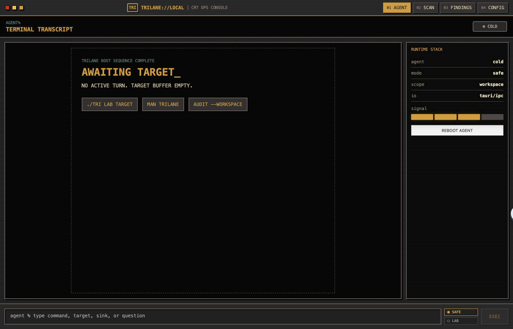
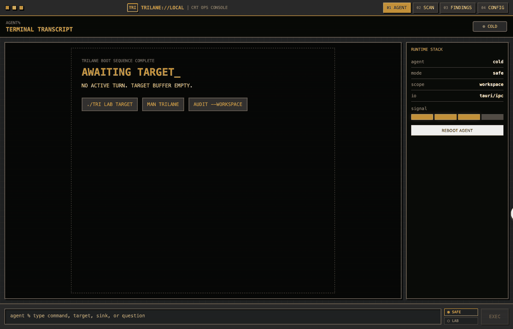

<h1 align="center">TriLane</h1>

<p align="center">
  <strong>Lane-orchestrated security agent for authorized gray-box vulnerability hunting.</strong>
</p>

<p align="center">
  <a href="https://www.npmjs.com/package/trilane"></a>
  <a href="./LICENSE"></a>
  
  
  
  
</p>

<p align="center">
  <code>S0 admission</code> -> <code>S1 attack surface</code> -> <code>S2 semantic lanes</code> -> <code>S3 merge</code> -> <code>S4 probing</code> -> <code>S5 findings</code>
</p>

TriLane turns one natural-language objective into a staged audit cockpit: admission, attack-surface graphing, six-lane semantic audit, merge, targeted probing, and adjudicated final findings.



## Quick Start

Install and launch the desktop app:

```bash
npm install -g trilane
trilane doctor
trilane app
```

Or run it without a global install:

```bash
npx trilane@latest app
```

Then choose **Safe** or **Lab** mode and describe the authorized target, for example:

```text
Penetration test juice-shop, source code is in ~/juice-shop, service is running on localhost:3000. If not, use colima or start the service directly
```



## What TriLane Does

- Builds an attack-surface graph before deep auditing.
- Runs a six-lane semantic audit across identity/auth, injection/client-side sinks, ingress/files/SSRF, business logic, configuration/secrets/crypto, and edge-surface coverage.
- Tracks Scan, Agent, Findings, and Config state in a desktop GUI.
- Probes high-signal variants in Lab Mode when the target is explicitly authorized.
- Deduplicates final findings with severity, evidence, payloads, code paths, and report export.
- Archives run transcripts under `~/.trilane/transcripts` for regression analysis.

## Modes

**Safe Mode** is the default. It is intended for exploration and lower-risk review.

**Lab Mode** grants the agent broader local filesystem and command execution access for the active target. Use it only on systems you own, operate, or are explicitly authorized to test.

## npm Package Status

The first npm package includes a prebuilt macOS Apple Silicon launcher binary. Other platforms can still run TriLane from source, or set `TRILANE_BIN` to a locally built binary:

```bash
TRILANE_BIN=/path/to/trilane-gui npx trilane app
```

## Build From Source

Requirements:

- Node.js 20 or newer
- Rust toolchain from `trilane-rs/rust-toolchain.toml`
- macOS for the current desktop build path

Build the frontend:

```bash
cd trilane-rs/trilane-gui/frontend
npm install
npm run build
```

Build and run the desktop binary:

```bash
cd ../../
cargo build -p trilane-gui --release
./target/release/trilane-gui
```

## Safety

TriLane is a dual-use security tool. Do not use it against systems where you lack permission. See [SECURITY.md](./SECURITY.md) for responsible-use boundaries, reporting guidance, and Lab Mode warnings.

## License

TriLane is licensed under the [Apache License 2.0](./LICENSE). Portions of the Rust workspace are derived from the OpenAI Codex project and retain their original Apache-2.0 notices.
